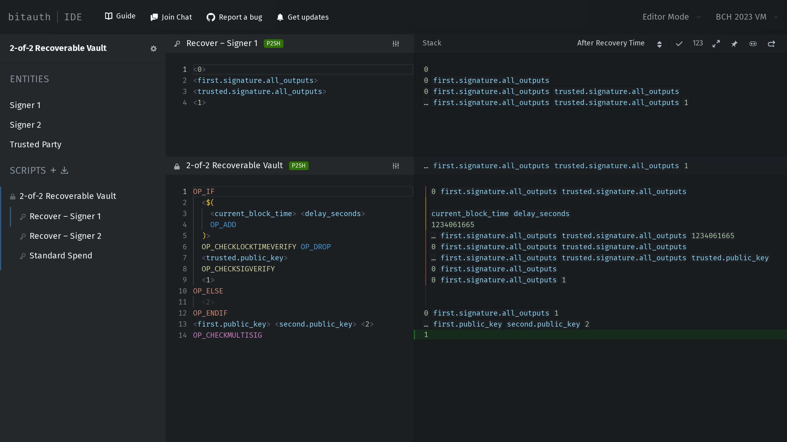
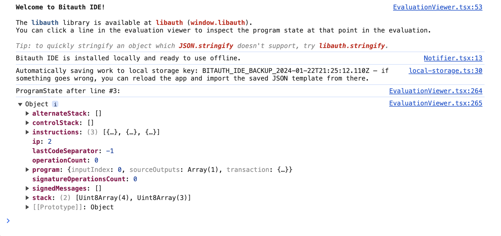
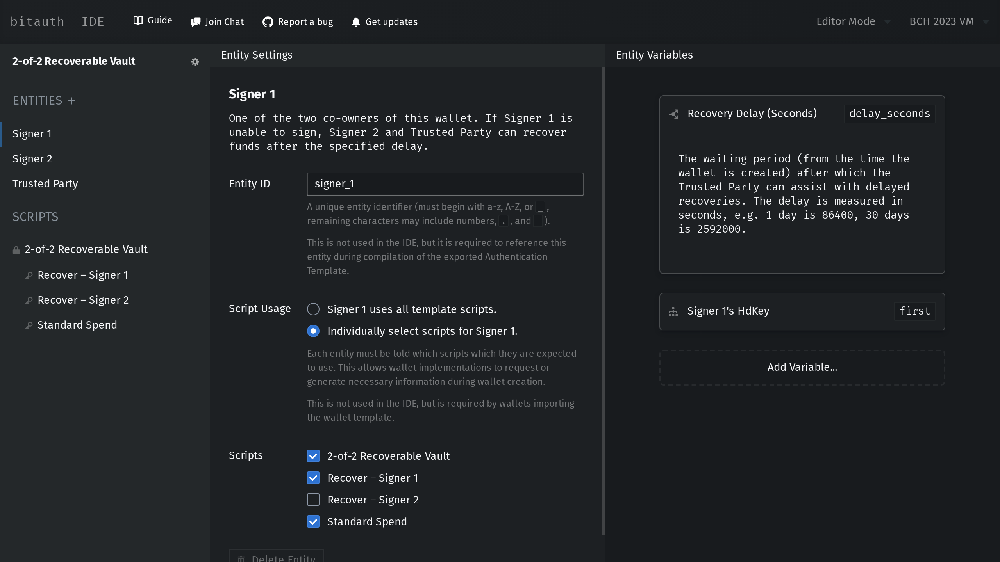
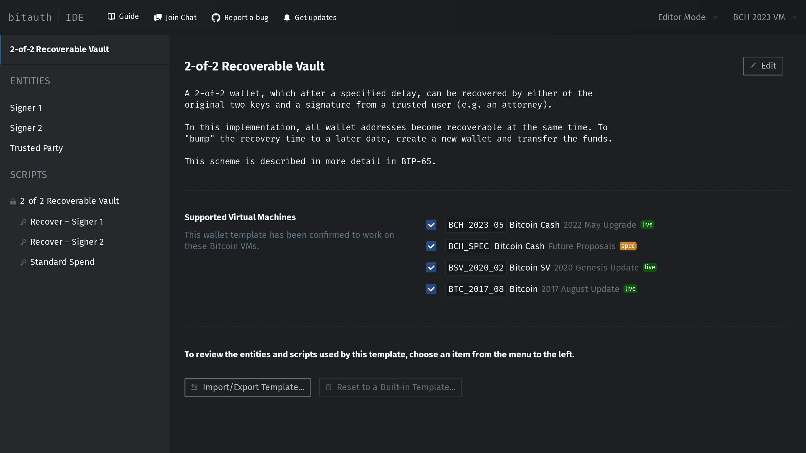
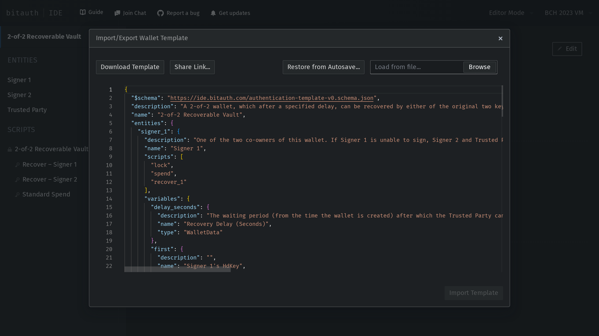

[](https://ide.bitauth.com/guide)
[](https://github.com/bitauth/bitauth-ide/actions/workflows/ci.yaml)
[](https://codecov.io/gh/bitauth/bitauth-ide)
[](https://t.me/bitauth_ide)
[](https://x.com/BitauthIDE)
[](https://github.com/bitauth/bitauth-ide)

# Bitauth IDE

**[Bitauth IDE](https://ide.bitauth.com/)** is an online, integrated development environment for bitcoin (cash) contracts. 

To get started, check out the [built-in guide](https://ide.bitauth.com/guide). An introductory video is also available [in this blog post](https://blog.bitjson.com/bitauth-ide-write-and-debug-custom-bitcoin-scripts-aad51f6e3f44), and you can also get help or share feedback in the [Bitauth IDE Telegram group](https://t.me/bitauth_ide).

### Debug Unlocking and Locking Scripts Together

Unlocking scripts can be edited alongside the locking scripts they unlock. The interactive evaluation viewer is constantly updated to display every step of the resulting evaluation as you type.



### Inspect the Evaluation in DevTools

Click on any stack item to log the program state at that step to the JavaScript developer console. The [Libauth](https://libauth.org/) library is available at `window.libauth` to make debugging easier.



### Create and Manage Entities and Variables

Create and modify the templates entities and the variables they contribute to wallets and evaluations.



### Describe and Document Wallet Templates

Review and modify the documentation included in the active template.



### Import and Export JSON Wallet Templates

Projects can be shared and re-imported in JSON format via files, sharable links, or plain text.



## Contributing

Pull Requests are welcome!

This application requires [Yarn](https://yarnpkg.com/) for development. With `Node.js` installed, the `yarn` package manager can be installed by running `corepack enable`. Once `yarn` is installed:

```sh
git clone https://github.com/bitauth/bitauth-ide.git
cd bitauth-ide
yarn
yarn start
```

This will open Bitauth IDE in development mode.

Bitauth IDE uses [Yarn's Zero-Installs strategy](https://yarnpkg.com/features/zero-installs) – all of [Bitauth IDE's dependencies are tracked in an independent git repository](https://github.com/bitauth/bitauth-ide-dependencies), and the dependency repo is automatically shallow-cloned into the `.yarn` directory.

To run all tests:

```sh
yarn test
```

To run all end-to-end tests locally, collect screenshots, and analyze code coverage:

```sh
yarn cov
```

Note that the end-to-end (e2e) tests also visually compare screenshots across test run. Because screenshots will differ slightly between platforms, this repo only stores and records results for `linux`, the platform used by the [continuous integration (CI) environment](./.github/workflows/ci.yml). Screenshots for macOS (`darwin`) and Windows (`win32`) are not committed to the repo, so you will need to run the tests once (prior to making any changes) to locally generate the baseline screenshots for your platform.

You can also run the e2e tests on the same platform as the CI environment using Docker. First, make sure Docker is running locally (consider using [Docker Desktop](https://www.docker.com/products/docker-desktop/)), then:

```sh
yarn start
# in another tab:
yarn e2e:docker
```

To run the e2e tests in Playwright's UI mode:

```sh
yarn e2e
```

To open the e2e test report in a browser (e.g. to review visual differences between screenshots):

```sh
yarn e2e:report
```

To build and run the production Progressive Web App (PWA):

```sh
yarn build
yarn preview
```
